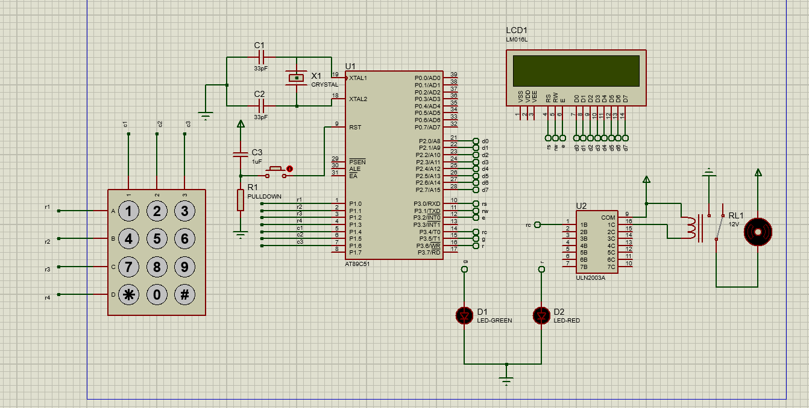

# 🔒 Keypad Passcode Security System

This project implements a passcode-based security system using an embedded system. The system uses a keypad to input a passcode, checks if the entered passcode matches the preset one, and provides feedback through a green or red LED and an LCD display. If the correct passcode is entered, the system allows access by turning on a motor and displaying a success message. If the wrong passcode is entered more than three times, the system blocks further attempts for one minute and displays a warning message on the LCD.

## ✨ Features
- 🔢 **Keypad Input**: Enter passcode using a 4x4 matrix keypad.
- ⚙️ **Motor Control**: Motor turns on when the correct passcode is entered.
- 💡 **LED Indicators**:
  - 🟢 **Green LED**: Indicates correct passcode and access granted.
  - 🔴 **Red LED**: Indicates incorrect passcode and access denied.
- 📟 **LCD Display**: Displays passcode entry status and messages such as "Try Again" or "Blocked for 1 min".
- 🕒 **Security Lock**: Blocks further attempts for 1 minute after 3 consecutive wrong passcodes.

## 🔧 Components Used
- 🖥️ **8051 Microcontroller**: Main controller for the system.
- 🔢 **4x4 Keypad**: Used for passcode input.
- 📟 **LCD Display (16x2)**: Displays messages to the user.
- 🔩 **DC Motor**: Simulates the access mechanism when the correct passcode is entered.
- 💡 **LEDs**:
  - 🟢 **Green LED**: Shows access granted.
  - 🔴 **Red LED**: Shows access denied.

## 🖼️ Circuit Diagram

The circuit consists of the following components connected to the 8051 microcontroller:
- 🔢 **Keypad** connected to specific pins of the microcontroller.
- 💡 **LEDs** (green and red) connected to output pins for feedback.
- 📟 **LCD** connected to the microcontroller for display output.
- 🔩 **DC Motor** controlled by the microcontroller to simulate the unlocking mechanism.

## 🔄 System Flow
1. **Enter Passcode**: The user enters a passcode using the keypad.
2. **Check Passcode**:
   - ✅ If the passcode is correct, the system turns on the motor and the green LED, and displays "Access Granted" on the LCD.
   - ❌ If the passcode is incorrect, the red LED lights up, the motor stays off, and the LCD displays "Try Again".
3. **Lockout**: After three failed attempts, the system displays "Blocked for 1 min" on the LCD and prevents further attempts for one minute.
4. **Retry After Lockout**: After one minute, the system allows the user to re-enter the passcode.

## 📋 Requirements
### 🛠️ Hardware:
- 🖥️ 8051 Microcontroller (or compatible)
- 🔢 4x4 Matrix Keypad
- 📟 16x2 LCD Display
- 🔩 DC Motor (for access simulation)
- 💡 Green and Red LEDs

### 💻 Software:
- 🛠️ Keil uVision for C programming
- 🖥️ Proteus for circuit simulation

## 📝 Code Explanation
- **Keypad Scanning**: The system scans the 4x4 keypad for the entered passcode.
- **Password Matching**: The entered passcode is compared with the preset passcode stored in the code.
- **Motor Control**: If the passcode is correct, the motor is turned on.
- **LED Feedback**: Green LED indicates correct passcode, while the red LED indicates incorrect entry.
- **LCD Display**: Provides feedback on the current status (correct passcode, incorrect entry, lockout).

## 🛠️ How to Use
1. 🔌 **Power on the system**.
2. 🔢 **Enter a passcode** using the 4x4 keypad.
3. 🔍 **Observe the feedback** on the LCD and LED:
   - ✅ If correct, the motor turns on, and the LCD displays "Access Granted".
   - ❌ If incorrect, the LCD shows "Try Again", and the red LED lights up.
4. 🔒 After three failed attempts, the system will display "Blocked for 1 min" on the LCD and prevent further attempts for one minute.
5. 🔄 After one minute, the system will reset, and you can re-enter the passcode.

